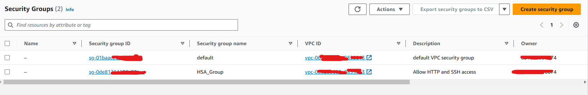
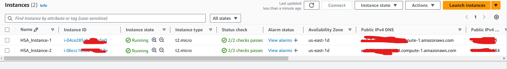
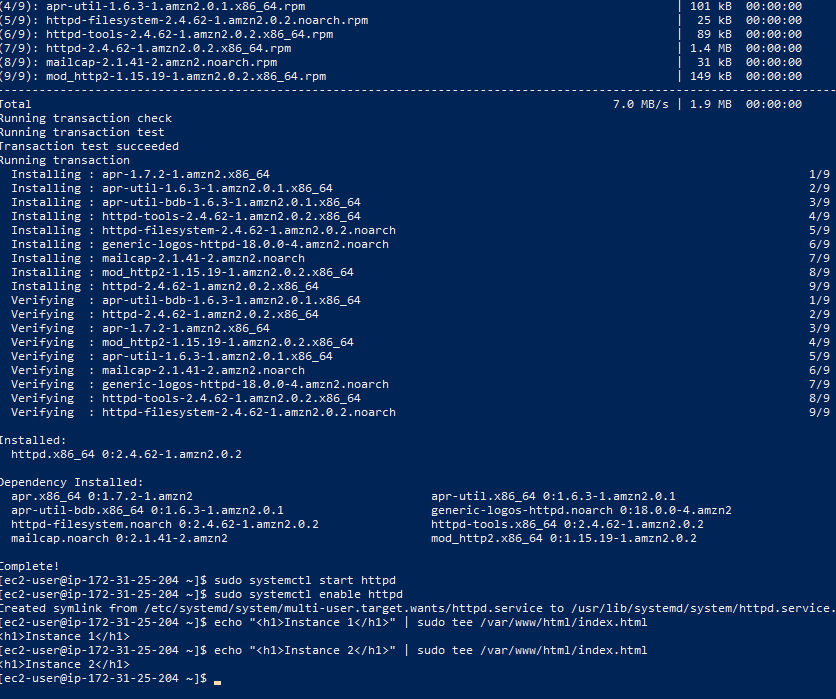
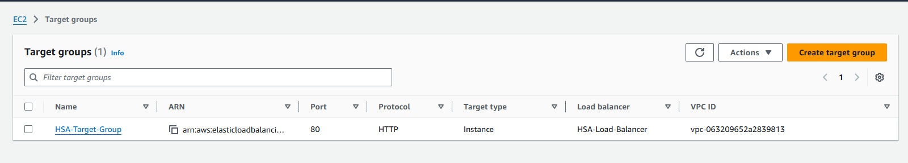
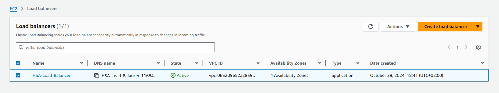
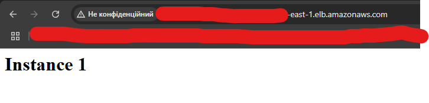
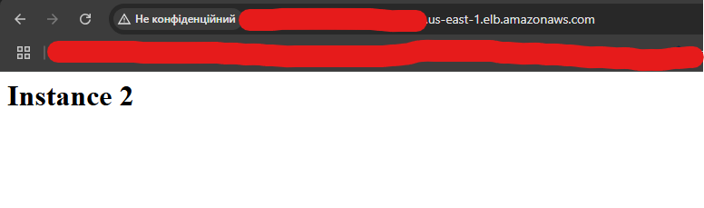

# AWS EC2 and Load Balancer Setup

This guide will help you create two EC2 instances with an Apache web server, set up an Application Load Balancer to
balance traffic between them, and configure Health Checks for both instances.

## Prerequisites

- AWS account
- Access to the AWS Management Console

## Setup Steps

### 1. Create a Key Pair for SSH Access

1. Log in to the **AWS Management Console**.
2. Go to **EC2 Console**.
3. In the left panel, select **Key Pairs** and click **Create key pair**.
4. Enter a name for the key (e.g., `MyKeyPair`) and save it on your computer (choose PEM format for Linux/Mac or PPK for
   Windows).

### 2. Create a Security Group

1. In the **EC2 Console**, select **Security Groups** from the left menu.
2. Click **Create security group**.
3. Enter a name (e.g., `my-security-group`) and add the following rules in **Inbound Rules**:

- **SSH**: TCP, port 22, Source – `My IP` or `0.0.0.0/0` for access from any IP (only for testing).
- **HTTP**: TCP, port 80, Source – `0.0.0.0/0` for public internet access.

4. Click **Create security group**.
   

### 3. Launch EC2 Instances

1. In the **EC2 Console**, click **Launch Instance**.
2. Enter a name (e.g., `Instance-1`) and select **Amazon Linux 2 AMI** as the image.
3. Choose **t2.micro** as the instance type.
4. Under **Key pair**, select `MyKeyPair`.
5. Under **Network settings** > **Edit** > **Security Group**, choose `my-security-group`.
6. Click **Launch instance**.
7. Repeat these steps for a second instance (name it `Instance-2`).
   

### 4. Set Up Web Server on Each Instance

1. Connect to each instance via SSH:
   ```bash
   ssh -i "MyKeyPair.pem" ec2-user@<Public_IP_Instance>
   ```

2. On each instance, run the following commands:

```bash
sudo yum update -y
sudo yum install -y httpd
sudo systemctl start httpd
sudo systemctl enable httpd
echo "<h1>Instance 1</h1>" | sudo tee /var/www/html/index.html
```

For the second instance, use `<h1>Instance 2</h1>`.


### 5. Create a Target Group

- In the EC2 Console, go to Target Groups.
- Click Create target group and choose Instances as the target type.
- Enter a name (e.g., my-target-group), set Protocol to HTTP and Port to 80.
- Add both instances to the target group.
  

### 6. Create an Application Load Balancer

- In the EC2 Console, go to Load Balancers > Create Load Balancer.
- Choose Application Load Balancer.
- Enter a name (e.g., my-load-balancer), set Scheme to Internet-facing, and IP address type to IPv4.
- In Network mapping, select the subnets and availability zones where your instances are located.
- In Listeners and routing, choose HTTP, port 80, and select your target group.
- Click Create load balancer.
  

### 7. Test the Load Balancer

After creating the Load Balancer, find its DNS name under the Description tab.

- Open the DNS name in a web browser. You should see alternating pages with "Instance 1" and "Instance 2" as you
  refresh.
  
  

### 8. Troubleshooting (if needed)

- Ensure your Security Groups allow HTTP connections.
- Verify that Apache is running on each instance.
- If instances remain unhealthy, check the Health Check settings in the target group.